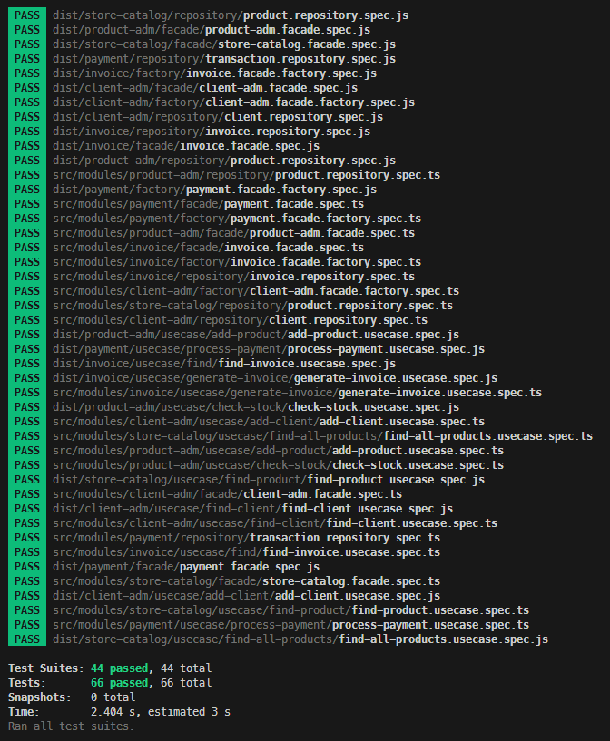

# Desafio: Criação de módulo de Invoice

Neste desafio será necessário criar o módulo completo de invoice - Nota Fiscal do Monolito.

Para este módulo você precisa utilizar:

- Os use cases de find e generate
- Especificar todas as entradas e saídas conforme o DTO exibido ao final deste enunciado.

Os campos do invoice são:

```typescript
id?: Id // criado automaticamente
name: string
document: string
address: Address // value object
items: InvoiceItems[] // Invoice Items entity
createdAt?: Date // criada automaticamente
updatedAt?: Date // criada automaticamente
```
 
A entidade InvoiceItems precisa ter:

```typescript
id?: Id // criada automaticamente
name: string
price: number
Para ser considerado completo, o módulo precisa ter o facade, factory, domain, gateway, repository e usecase.

// DTO Find
export interface FindInvoiceUseCaseInputDTO {
  id: string;
}

export interface FindInvoiceUseCaseOutputDTO {
  id: string;
  name: string;
  document: string;
  address: {
    street: string;
    number: string;
    complement: string;
    city: string;
    state: string;
    zipCode: string;
  };
  items: {
    id: string;
    name: string;
    price: number;
  }[];
  total: number;
  createdAt: Date;
}

// DTO Generate
export interface GenerateInvoiceUseCaseInputDto {
  name: string;
  document: string;
  street: string;
  number: string;
  complement: string;
  city: string;
  state: string;
  zipCode: string;
  items: {
    id: string;
    name: string;
    price: number;
  }[];
}

export interface GenerateInvoiceUseCaseOutputDto {
  id: string;
  name: string;
  document: string;
  street: string;
  number: string;
  complement: string;
  city: string;
  state: string;
  zipCode: string;
  items: {
    id: string;
    name: string;
    price: number;
  }[];
  total: number;
}
```
Toda essa implementação deverá ser reproduzida através de testes.

* A linguagem de programação para este desafio é TypeScript

Reultado dos testes



[Branch do desafio resolvido](https://github.com/uiratan/fullcycle-archdev-monolith/tree/invoice-module)

# Observação sobre tabela products
Uma vez que usamos o Sequelize neste módulo, tanto a tabela de product de product-adm quando a de store-catalog receberam o mesmo nome em models. Com isto, ao desenvolver o desafio de API, você deve encontrar o erro de inserção de product, pois o ORM criará apenas uma das tabelas e, ao inserir valores de product na tabela, ocorrerá um erro por falta de um campo específico.

Pra solucionar isto, siga as instruções na branch migrations do repositório deste módulo.

https://github.com/devfullcycle/fc-monolito/tree/migrations

Obs.: Para os testes de integração, substitua o 'await sequelize.sync({ force = True})' pelo 'await migration.up()' como exemplificado no link abaixo.

https://github.com/devfullcycle/fc-monolito/blob/386b5a5a4ea1d20a8ba1de56b9babcefab469759/src/test-migrations/product-migrations.spec.ts#L29-L39


# Desafio: Criação de API

Agora que temos todos os usecases, precisamos disponibilizar os endpoints para que possamos realizar uma compra.

Disponibilize os seguintes endpoints:

POST /products
POST /clients
POST /checkout/
GET /invoice/<id>

* A linguagem de programação para este desafio é TypeScript

Implemente os testes end-to-end destes endpoints com a lib supertest, ao rodar o comando "npm run test" a aplicação deve executar todos os testes. Se tiver dúvidas de como usar o supertest acesse o módulo de Clean Arch no módulo Camada de API.

[Branch do desafio resolvido](https://github.com/uiratan/fullcycle-archdev-monolith/tree/api)